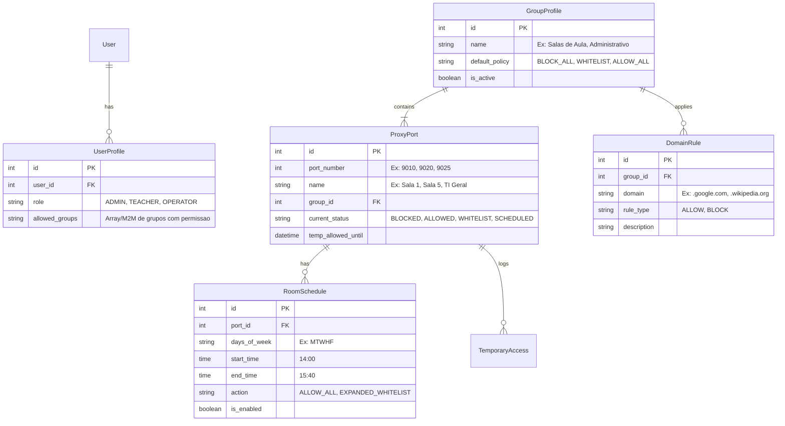

# Planejamento do Banco de Dados - SquidPanel

Este documento avalia e define a estratégia de persistência de dados para o **SquidPanel**.

---

## 1. Análise Comparativa de Banco de Dados

| Critério | SQLite (com WAL Mode) | PostgreSQL | MySQL / MariaDB |
| :--- | :---: | :---: | :---: |
| **Consumo de Memória RAM** | **0 MB** (Embutido no processo) | ~50 - 80 MB | ~80 - 120 MB |
| **Complexidade de Instalação** | **Zero** (Arquivo único local) | Média (Serviço, usuários, sockets) | Média |
| **Facilidade de Backup** | **Instantâneo** (Copiar 1 arquivo `.sqlite3`) | `pg_dump` ou backup do cluster | `mysqldump` |
| **Desempenho de Leitura (Admin Web)** | **Ultrarrápido** (< 1ms) | Muito rápido | Muito rápido |
| **Concorrência de Escrita** | Alta (com WAL habilitado) | Muito alta | Muito alta |
| **Ideal para o Container LXC** | ⭐ **Recomendado** | Opcional | Opcional |

---

## 2. Decisão Arquitetural: Por que SQLite (WAL Mode)?

1. **Volume de Dados do SquidPanel:**
   * O banco de dados do painel **NÃO** precisa armazenar milhões de linhas de log HTTP (o próprio Squid já armazena os logs de acesso em arquivos otimizados com `logrotate`).
   * O banco armazenará apenas:
     - Cadastro de Usuários e Permissões (~10 a 50 registros)
     - Grupos e Salas/Portas (~5 a 30 registros)
     - Regras de Whitelist / Blacklist (~100 a 5.000 registros)
     - Agendamentos e Logs de Auditoria de Ações Administrativas (~1.000 a 10.000 registros)
2. **Confiabilidade e Isolamento:**
   * O banco fica contido dentro de `/var/www/SquidPanel/db.sqlite3`.
   * Restaurar o sistema em outro servidor resume-se a copiar a pasta da aplicação.
3. **Write-Ahead Logging (WAL Mode):**
   * Permite que múltiplos leitores acessem o banco ao mesmo tempo em que uma escrita ocorre, eliminando travamentos de banco bloqueado (`database is locked`).

---

## 3. Modelo de Entidades do SquidPanel

---

## 4. Conclusão

Adotaremos o **SQLite configurado com WAL Mode** como padrão nativo do SquidPanel. A estrutura do Django ORM manterá compatibilidade total para que, caso o usuário deseje no futuro migrar para PostgreSQL em cenários de cluster, baste alterar 4 linhas no `settings.py`.
